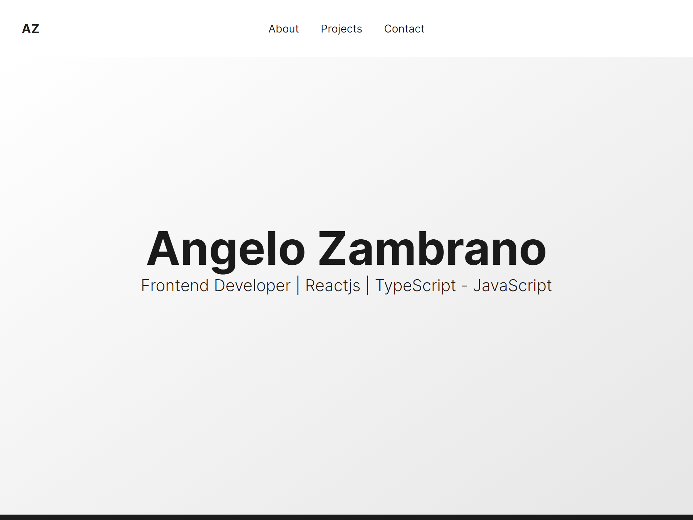

# Portfolio

_This is my personal website where I show my most important projects, about me and my social networks._

## Starting

_You can clone this repository to have the project local:_

```bash
git clone https://github.com/angelozdev/portfolio.git
```

_Install the necessary dependencies in the root of the project:_

```bash
npm install
```

_Run the following command to start the project in development mode:_

```bash
npm run dev
```

## Deploy

_You can see the project in production [Portfolio](https://portfolio.angelozdev.vercel.app/)_

## Built with

_Technologies used in the frontend:_

-  **@emotion** is a library designed for writing css styles with JavaScript.
-  **Babel** is a toolchain that is mainly used to convert ECMAScript 2015+ code into a backwards compatible version of JavaScript in current and older browsers or environments.
-  **ESLint** A pluggable and configurable linter tool for identifying and reporting on patterns in JavaScript.
-  **Husky** can prevent bad git commit, git push and more.
-  **Prettier** An opinionated code formatter; Supports many languages; Integrates with most editors.
-  **ReactJS** A JavaScript library for building user interfaces.
-  **Stylelint** A mighty, modern linter that helps you avoid errors and enforce conventions in your styles.
-  **TypeScript** is an open-source language which builds on JavaScript, one of the world’s most used tools, by adding static type definitions.
-  **Webpack** is a module bundler. Its main purpose is to bundle JavaScript files for usage in a browser, yet it is also capable of transforming, bundling, or packaging just about any resource or asset.

## Preview



## License

This project is under the License (MIT) - see the file [LICENSE.md](LICENSE.md) for details
